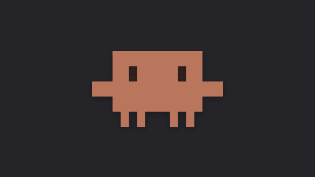
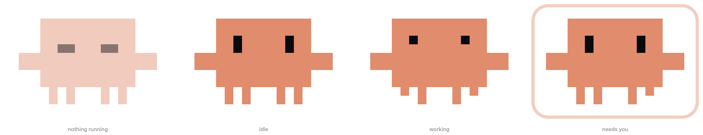
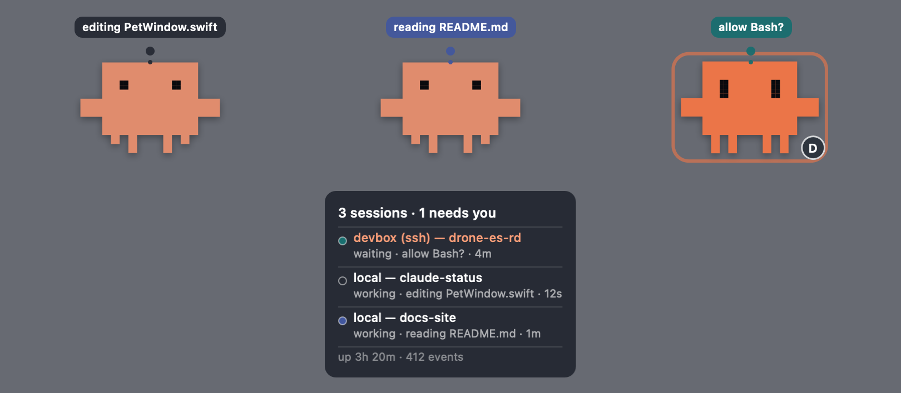
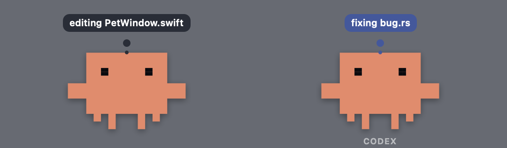

<div align="center">

# claude-status

**A desktop pet for macOS that shows you what Claude Code is doing — including sessions on a remote host over SSH.**

[](https://github.com/donald-heddesheimer/claude-status/actions/workflows/ci.yml)
[](https://github.com/donald-heddesheimer/claude-status/releases)
[](LICENSE)




</div>

It shuffles its feet while Claude works, jitters inside a pulsing ring when Claude
is blocked on you, and shuts its eyes when nothing is running. A thought bubble
says what Claude is actually doing — `editing SessionStore.swift`, not `Edit`.

---

## Install

```bash
git clone https://github.com/donald-heddesheimer/claude-status
cd claude-status && ./install.sh
```

Builds the app, installs it to `/Applications`, registers the Claude Code
plugin, and starts it. Takes about ten seconds — there are no dependencies to
fetch.

> **Hooks apply to newly started sessions.** Open a new Claude Code session and
> the pet starts reacting.

**Requirements:** macOS 13+, Apple's command line tools (`xcode-select --install`),
and Claude Code on any machine you want to watch.

<details>
<summary><b>Why it builds from source instead of downloading a binary</b></summary>

<br>

macOS quarantines downloaded apps and refuses to open any that aren't notarised
by a paid Apple Developer account. Release artifacts here are signed ad-hoc, so a
downloaded build will not open — while software you compile yourself is never
quarantined.

The signing and notarisation path is written and waiting in
[`scripts/build-app.sh`](scripts/build-app.sh); it needs an Apple Developer
Program membership to switch on. Until then, building locally is the honest
recommendation rather than telling you to strip a quarantine attribute. See the
[roadmap](ROADMAP.md).

</details>

<details>
<summary><b>Other install options</b></summary>

<br>

```bash
./install.sh --dev         # register the plugin from this clone, for development
./install.sh --no-plugin   # app only
./install.sh --no-launch   # install without starting
./install.sh --prefix DIR  # somewhere other than /Applications
swift run --package-path mac-app   # foreground debug build, no install
```

To install the plugin on another machine — a remote host, say:

```bash
claude plugin marketplace add donald-heddesheimer/claude-status
claude plugin install claude-status@claude-status
```

Uninstall with `rm -rf /Applications/claude-status.app`.

</details>

---

## Using it

| Gesture | Action |
|---|---|
| **Click** | Bring Claude to the front |
| **Drag** | Move it; the position persists |
| **Hover** | Panel listing every session it knows about |
| **Right-click** | Settings, health, session list, follow one session, reset position, quit |

### What the pet is telling you



| Claude is… | The pet | Bubble |
|---|---|---|
| thinking or working | bobs, legs shuffling, eyes squinting | `editing PetView.swift` |
| **blocked on you** | jitters and hops inside a pulsing ring | `allow Bash?` |
| **just finished** | hops with a delighted `^ ^` and throws a few sparks, for 2½ seconds | — |
| idle | settles, breathes, blinks | — |
| not running at all | eyes shut, dimmed | — |

The finish flourish fires when the **last** working session goes idle, so a pet
watching four of them celebrates once — when the work is actually done, not four
times and not while three are still running.

### Several sessions at once



Sessions collapse into one mood, and **waiting outranks working** — the session
that needs you is the one worth surfacing. Hover for the full list, whatever
needs you first.

With more than one running, each session gets **its own bubble colour**, so a
glance tells you which one is talking. Colours are handed out in the order
sessions appear and hold still for as long as the session lasts; the first is
always black, so nothing changes until there is a second. The dots in the hover
panel and the right-click menu are where you learn which is which.

Or stop juggling: **Settings ▸ Sessions ▸ Follow one session at a time**, or just
right-click and pick one. The pet's mood, bubble, animation and finish flourish
then come from that session alone, and the hover panel lists it and says how many
it's hiding. If it ends, the pet adopts another rather than going blank. **All
sessions** puts everything back.

### Watching more than one agent



Every event carries which agent sent it, and anything speaking the same
protocol — Codex, opencode, whatever's next — shares this pet rather than
opening a second one. One agent looks exactly like it always has. A second
gets its own colour, shared by all of that agent's sessions, and its name
appears under the critter so you know who's talking without a separate window
competing for space.

---

## Remote sessions over SSH

The pet runs on your Mac; Claude Code runs on the remote host. One SSH reverse
tunnel connects them, and **Settings → Remote** will set it up: it lists your host
aliases, proposes the config line, backs up `~/.ssh/config` before writing, then
tests the tunnel and explains what came back.

<details>
<summary><b>Doing it by hand</b></summary>

<br>

**1.** Start the pet: `open -a claude-status`

**2.** Add the tunnel to `~/.ssh/config` **on your Mac**:

```
Host devbox
    HostName devbox.example.com
    User you
    RemoteForward 7777 127.0.0.1:7777
```

**3.** Reconnect. `RemoteForward` only applies to new connections.

**4.** Verify from the remote host before installing anything:

```bash
curl -s -m 2 -o /dev/null -w 'HTTP %{http_code}\n' \
  -X POST http://127.0.0.1:7777/state \
  -H 'Content-Type: application/json' \
  --data-raw '{"state":"waiting","session_id":"tunnel-test","host":"devbox","remote":true}'
```

`HTTP 200` and a pulsing pet means you're done. Connection refused means the
tunnel isn't up — recheck steps 2 and 3.

**5.** Install the plugin on the remote host (see [Install](#install) above).

Or run `./scripts/setup-remote.sh devbox --write` to generate and verify it.

</details>

> **VS Code Remote-SSH** reads `~/.ssh/config`, so the same entry covers both the
> extension and a plain terminal. Under Remote-SSH, Claude Code runs on the
> *remote* host — that's where the plugin belongs.

### ⚠️ Shared hosts

`RemoteForward` binds **one** `127.0.0.1:7777` for the whole machine, and it
belongs to whoever connected. On a host you share with colleagues, their
claude-status hooks post into *your* tunnel — their file names and permission
prompts on your desktop.

Filtering by account keeps their ordinary work off your screen:

```bash
echo yourname > ~/.claude-status/users
```

**But the username is self-reported by the hook, so it is a convenience filter,
not a security boundary.** For an actual boundary, use a shared token — see
[SECURITY.md](SECURITY.md), which is specific about the difference.

---

## Configuration

Everything lives in **Settings**, from the pet's right-click menu: port, what a
click opens, allowed accounts, the token file, launch at login, debug logging,
which sessions the pet watches and how it colours them, and a **Health** tab
showing whether the listener is bound, when the last event arrived, and why the
last rejected event was rejected.

Environment variables still work and **take precedence** over Settings, so
existing setups keep behaving as they did. Settings marks any field an
environment variable is overriding rather than silently ignoring your input.

| Variable | Default | Meaning |
|---|---|---|
| `CLAUDE_STATUS_PORT` | `7777` | Port used by both hook and pet |
| `CLAUDE_STATUS_USERS` | *(all)* | Accounts the pet accepts, comma separated. Also read from `~/.claude-status/users` |
| `CLAUDE_STATUS_USER` | *(unset)* | Hook-side: stay silent unless running as this account |
| `CLAUDE_STATUS_DEBUG` | `0` | `1` logs every event received, taken or dropped |
| `CLAUDE_STATUS_FOLLOW_ONE` | `0` | `1` follows a single session instead of collapsing them |
| `CLAUDE_STATUS_BUBBLE_COLORS` | `1` | `0` draws every thought bubble in the default black |
| `CLAUDE_STATUS_CLICK_APP` | `/Applications/Claude.app` | What a click opens — app path or bundle id |
| `CLAUDE_STATUS_CLICK_DISABLE` | `0` | `1` makes clicking the pet do nothing |
| `CLAUDE_STATUS_ART` | `~/.claude-status/pet.png` | Override artwork with your own PNG |
| `CLAUDE_STATUS_TOKEN_FILE` | `~/.claude-status/token` | Shared secret, if you want one |

**Killswitch.** `touch ~/.claude-status/disabled` silences the hooks without
touching any configuration. Delete the file to resume.

---

## Troubleshooting

Run `/claude-status:status` inside any Claude Code session. It reports whether
you're local or remote, whether anything is listening, and whether a test event
actually lands. Then check **Settings → Health**.

The hooks cannot hurt a session: `curl` is detached from the hook's process
group, capped at a one-second connect timeout, and the script always exits 0. If
the pet is down, your laptop is asleep, or the tunnel dropped, Claude Code never
notices.

Common problems and the tested-version matrix are in [SUPPORT.md](SUPPORT.md).

---

## How it works

```
  LOCAL                                 REMOTE (ssh)
  ─────                                 ────────────
  claude ──► hook ──► 127.0.0.1:7777    claude ──► hook ──► 127.0.0.1:7777
                          │                                     │
                          ▼                             SSH RemoteForward
                     [ the pet ]                                │
                          ▲                                     │
                          └─────────────────────────────────────┘
```

Hooks post to `127.0.0.1:7777` and never learn where they are. Locally that
address is the pet; remotely it's an SSH reverse tunnel back to the pet.
**Identical plugin, identical configuration, both cases.**

No runtime dependencies — the listener is `Network.framework`, the pet is drawn
with AppKit, and the hook needs only `curl`.

| Path | Role |
|---|---|
| `hooks/hooks.json` | Maps six Claude Code lifecycle events to states |
| `hooks/emit.sh` | Reads the hook payload, posts state; always exits 0 |
| `mac-app/…/StateServer.swift` | Loopback HTTP listener |
| `mac-app/…/SessionStore.swift` | Tracks sessions, collapses them to one mood |
| `mac-app/…/PetSprite.swift` | The critter's cell map — the app icon renders from it |
| `mac-app/…/PetWindow.swift` | Borderless floating panel and rendering |
| `mac-app/…/Preferences.swift` | Settings store; environment variables win |
| `install.sh` · `scripts/` | Install, packaging, SSH setup, manifest checks |

### Developing

```bash
swift test --package-path mac-app     # 112 unit tests
bash tests/emit_test.sh               # 67 hook tests, incl. one end to end
./scripts/check-manifests.sh          # manifests and changelog
```

CI runs all three on every push and pull request, plus shellcheck and a full
`.app` build. See [CONTRIBUTING.md](CONTRIBUTING.md).

---

## Documentation

| | |
|---|---|
| [SUPPORT.md](SUPPORT.md) | Troubleshooting and tested versions |
| [SECURITY.md](SECURITY.md) | Threat model, and reporting a vulnerability |
| [CONTRIBUTING.md](CONTRIBUTING.md) | Building, testing, and what to know before changing things |
| [docs/design.md](docs/design.md) | Why the pet moves and reads the way it does |
| [CHANGELOG.md](CHANGELOG.md) | What changed, and when |
| [ROADMAP.md](ROADMAP.md) | What's planned, and what's been declined |

---

## Alternatives

[`gmr/claude-status`](https://github.com/gmr/claude-status) signals state through
a `.cstatus` file plus Darwin notifications. Both are local-only by
construction, so remote sessions are an architectural exclusion rather than a
missing feature. This project uses loopback HTTP specifically because SSH can
forward it.

[petdex](https://github.com/agiagentsdev/agentpets-dev) shares port `7777` and
the `X-Petdex-Update-Token` header, so the two are wire compatible — run only one
at a time, or both will drive the window.

## Contributing

Pull requests welcome. [CONTRIBUTING.md](CONTRIBUTING.md) will get you building
in a couple of minutes, and [docs/design.md](docs/design.md) covers the reasoning
behind the parts that look odd on purpose.

## License

MIT
